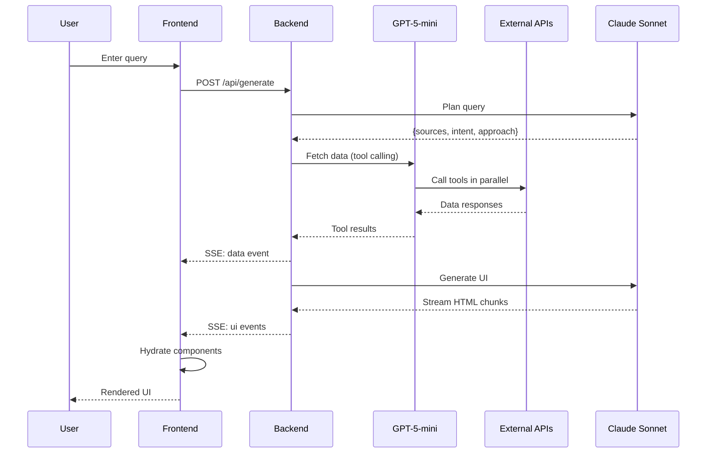
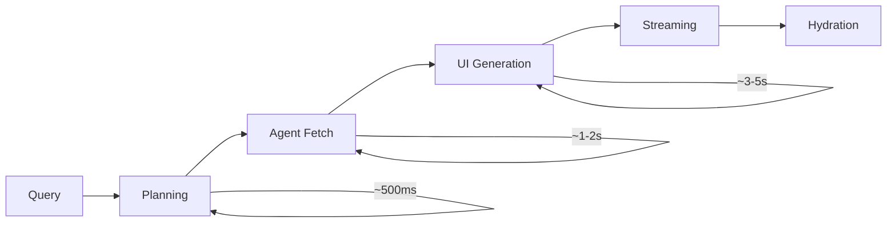
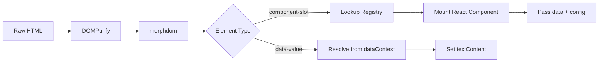
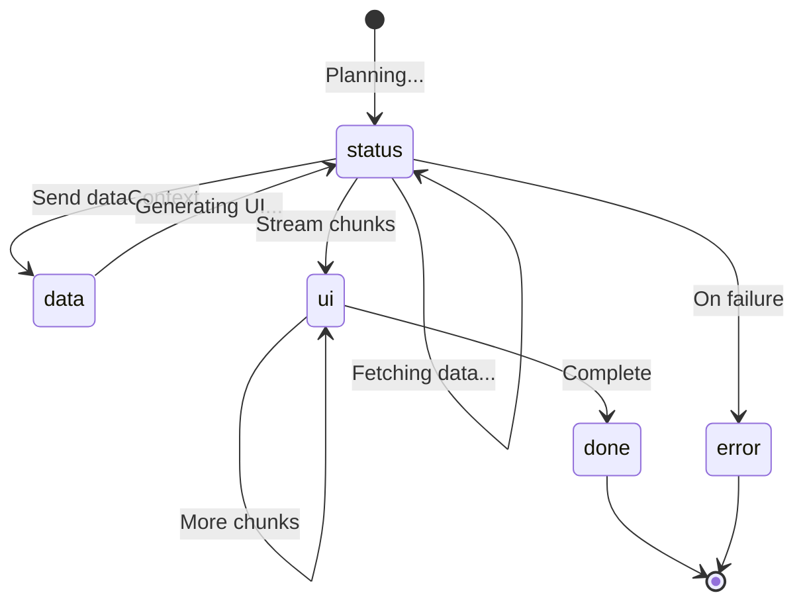
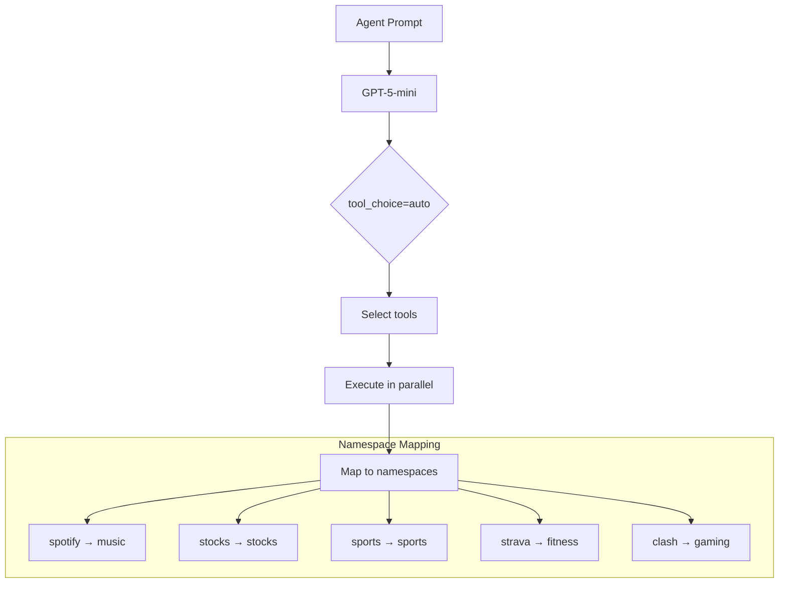

# Architecture Overview

## System Flow



## Pipeline Stages



| Stage | Model | Purpose |
|-------|-------|---------|
| Planning | Claude Sonnet | Classify intent, determine sources |
| Agent Fetch | GPT-5-mini | Tool calling to fetch real data |
| UI Generation | Claude Sonnet | Stream HTML with data bindings |

## Data Flow

```mermaid
flowchart TD
    subgraph Backend
        A[/api/generate] --> B[plan_and_classify]
        B --> C[Agent with Tools]
        C --> D[build_ui_prompt]
        D --> E[Stream Response]
    end

    subgraph Tools
        C --> T1[spotify_fetch_user_data]
        C --> T2[stocks_fetch_stock_info]
        C --> T3[sports_fetch_nba_summary]
        C --> T4[strava_get_activities]
        C --> T5[clash_get_player]
    end

    subgraph Frontend
        E --> F[SSE Parser]
        F --> G[data event → dataContext]
        F --> H[ui events → htmlContent]
        G --> I[HybridRenderer]
        H --> I
        I --> J[morphdom diff]
        J --> K[Mount React components]
    end
```

## Component Hydration



## SSE Event Types



## Tool Calling



## Key Files

| File | Purpose |
|------|---------|
| `backend/main.py` | API endpoints, agent orchestration |
| `backend/prompts.py` | LLM system prompts |
| `backend/data.py` | Component schemas, mock data |
| `backend/tool_generator.py` | @tool_function decorator |
| `backend/integrations/*.py` | Data fetchers with tool metadata |
| `frontend/stores/stream.ts` | SSE handling, state management |
| `frontend/components/HybridRenderer.tsx` | DOM diffing, component mounting |
| `frontend/components/registry.ts` | Component type → React component |

## Endpoints

| Endpoint | Method | Purpose |
|----------|--------|---------|
| `/api/generate` | POST | Main UI generation with agent |
| `/api/generate-legacy` | POST | Legacy mock data version |
| `/api/query` | POST | Direct agent testing |
| `/api/refine` | POST | Edit existing UI |
| `/health` | GET | Health check |
